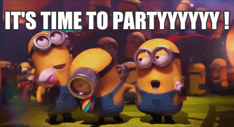

class: center, middle, nopadding, blackbg

---

class: center, middle

background-image: url(images/melee.jpg)

???
disclaimer  
foot dégoût du sport d'équipe / aïkido  
groupes : jdr, rock band    
diplôme en 1995, projets en binôme
curieusement, rarement en "vraie équipe"  

---

class: center, middle

???
2013 - embauche chez PeopleDoc - équipes, sous-équipes (feature teams)

---

class: center, middle

background-image: url(images/terrain.jpg)

???
voici le cadre  
métaphores (cuisine) + limites  
supporters

---

class: center, middle

background-image: url(images/training.jpg)

???
formation / exercices  
combinaisons / tirs de pénalité  
lancers francs basket  
sparring partner

---

background-image: url(images/clock.jpg)

???
la quasi-totalité des sports co sont limités dans le temps

---

class: right
background-image: url(images/half-time.jpg)

# Mirétrotempspective

???
ne pas oublier les rétros après le match, séances de video

---

# DOD

> Un but est marqué quand le ballon a entièrement franchi la ligne de but, entre les montants du but et sous la barre transversale, sous réserve qu'aucune infraction aux Lois du Jeu n'ait été préalablement commise par l'équipe en faveur de laquelle un but aura été marqué.  
> — Loi 10 du football

---

# DOD

> Un essai est marqué lorsque le ballon se trouve dans l'en-but adverse et qu'un joueur exerce sur lui une pression de haut en bas avec toute partie avant du corps comprise entre la taille et le cou, taille et cou inclus.

---

background-image: url(images/ruck.jpg)

# Petits tas

???
jeu d'occupation et de "gagne-terrain" (Foot US)  
itération

---

class: center, middle

???
stratégie tableau blanc/noir, composition d'équipe  
répétitions, sparring partner, kata  
automatismes

---

# Déjà vu non ?

> Aucun plan de bataille ne survit au contact de l'ennemi.  
> — Helmuth Karl Bernhard von Moltke

???
Les automatismes servent à réagir aux changements

---

background-image: url(images/tarot.jpg)

# Qui gagnera la coupe du monde ?

???
Même Paul le Poulpe n'en est jamais certain

---

# Une équipe pluridisciplinaire

.center[]

> En rugby, il y a ceux qui jouent du piano et ceux qui les déménagent.  
> — Pierre Danos

???
différences morphos, peu à peu moindres (polyvalence dans le jeu)

---

background-image: url(images/zlatan.jpg)

# Embaucher des rock-stars

---

> Un joueur phare, c'est quelqu'un qui est là pour éclairer, pas pour éblouir.  
> — Jean-Pierre Elissalde

---

background-image: url(images/islande.jpg)

???
300k habitants, demi-finale de l'Euro 2016, a battu le Portugal en poule, a fait 1-1 vs. l'Argentine en 2018.

---

class: center, middle

# Le « Pack »

---

class: center, middle

# Le « Liant »

---

class: center, middle

???
Passe aveugle, décontraction, inattendu mais propre

---

class: center, middle

???
Décontraction totale ; il MARCHE après

---

class: center, middle
# Expertise, oui, mais au service du collectif

---

background-image: url(images/rugby-pass.jpg)

# La somme des interactions

---

background-image: url(images/rugby-pass.jpg)

# La QUALITÉ des interactions

---

> Si on n'a rien compris à la passe, on n'a rien compris au rugby.  
> — Maurice Prat

???
La passe qui arrive lancée, le sens du placement, se trouver sans se chercher.
transmission, amélioration de la qualité, lutte contre la dette, transformation du jeu

---

# Troisième mi-temps

.center[]

???
ça dépend, rugby pro, tolérance limitée (débordements)

---

background-image: url(images/capitaine-flam.jpg)

???
Capitaine, choix des équipiers, respect (pas forcément le meilleur joueur)
il est sur le pré, il produit autant que les autres, irréprochabilité, guide.

---

class: center, middle

# La place des femmes

???
Pas brillant, mais prise de conscience (sport féminin de mieux en mieux médiatisé)

---

background-image: url(images/quidditch.jpg)

???
Quidditch !

---

class: bottom, right
background-image: url(images/coach.jpg)

# Et le coach ?

???
Pas sur le terrain, un peu une posture de chef de projet

---

class: center, middle

# Où est le scrum master ?

???
!= coach, parce pas sur le terrain  
garant du jeu, porté en triomphe

---

background-image: url(images/referee.jpg)

---

# @brunobord

.center[![Problem / Coffee -> [ ] -> Code (+Sarcasm)](./images/coffee-code-sarcasm.jpg)]

---

class: center, middle

# Merci
